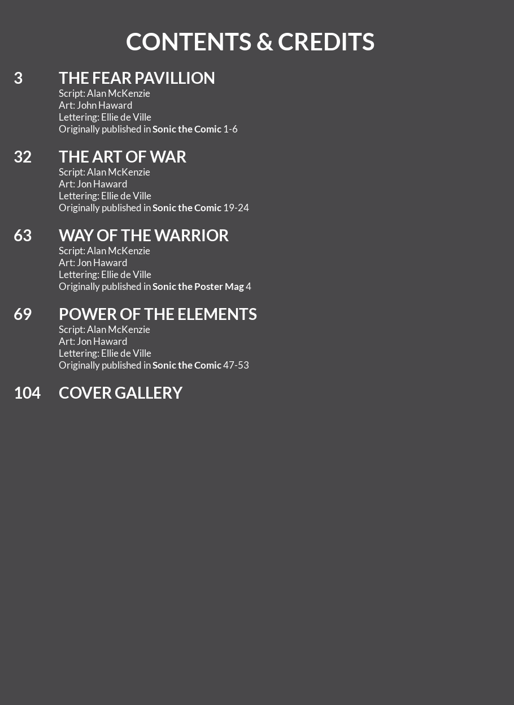
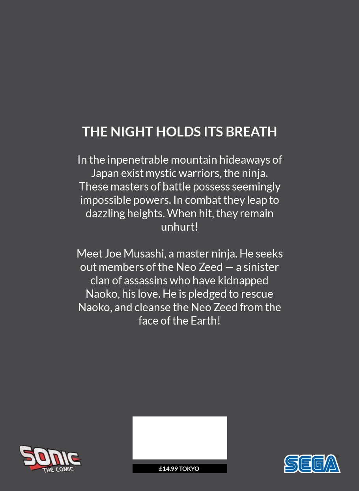
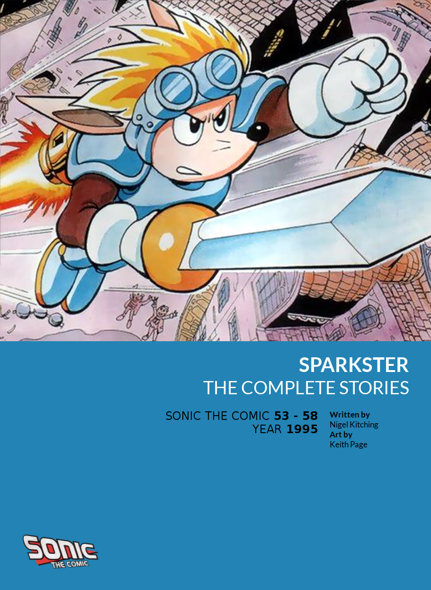

# Sonic the Graphic Novel Collection

*Sonic the Graphic Novel Collection* is a fan project to recompile the stories from the 1990's UK comic [Sonic the Comic](https://en.wikipedia.org/wiki/Sonic_the_Comic) into a standalone graphic novel format, complete with new front and back covers, contents pages, and improved image quality. Check out [the previews section of this page](#previews) to see what this looks like!

The presentation of these graphic novels is inspired by [The Judge Dredd Case Files](https://shop.2000ad.com/catalogue/graphic-novels/dredd-case-files): Stories that were originally split into multiple parts have been joined back together, spin-off stories have been carefully placed to flow seamlessly with the main strip, and unrelated articles and adverts have been removed. All in all: these novels aim to be the best possible way to read the comic stories from *Sonic the Comic*.

## How to Read

To read *Sonic the Graphic Novel collection*, you'll first need to acquire digital copies of *Sonic the Comic*, *Sonic the Poster Mag*, *Sonic the Summer Special*, the two *Sonic Holiday Specials* and the *Knuckles Knock-Out Special*. These aren't redistributed here, but can be found on [The Internet Archive](https://archive.org/) (The spin-off comics are optional, but you'll miss out on some good stories without them). Once you've collected all your issues, do the following:

1. Download this GitHub repository (by clicking "Code" then "Download ZIP" in the top right corner of this page)
2. Extract the .ZIP file to a folder on your computer
3. Create a new folder called "issues", and place all of your downloaded .cbz files into this folder
4. Double-click "Export.bat". You'll be asked whether or not you want enhance the image quality on your comic files. This is optional, but will greatly improve the image quality of your comics. Press Y or N to choose
5. When the export process is finished, you'll find your new graphic novels in a newly created folder called "volumes". These can now be read in a CBZ reader of your choice!

## Previews

These images of the new covers and contents pages in *Sonic the Graphic Novel collection* should give some idea of how the stories are laid out in these volumes compared to the original comics:

### Sonic the Hedgehog - Volume 1
  

### Sonic the Hedgehog - Volume 2
  

### Sonic the Hedgehog - Volume 3
  

### Sonic the Hedgehog - Volume 4
  

### Sonic the Hedgehog - Volume 5
  

### Sonic the Hedgehog - Volume 6
  

### Sonic the Hedgehog - Volume 7
  

### Sonic the Hedgehog - Volume 8
  

### Sonic the Hedgehog - Volume 9
  

### Tails - Volume 1
  

### Shinobi
  

### Golden Axe
  

### Streets of Rage
  

### Ecco the Dolphin
  

### Sparkster
  

The project is a work in progress: new volumes will be uploaded over the next few weeks as they are completed. In total, there are 25 volumes planned, covering all the stories ever published in *Sonic the Comic*. Watch this space!
